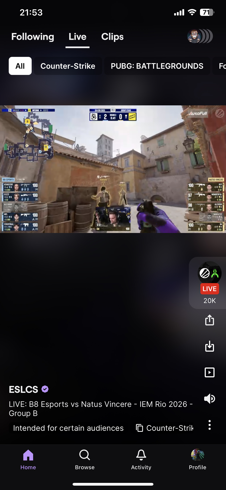
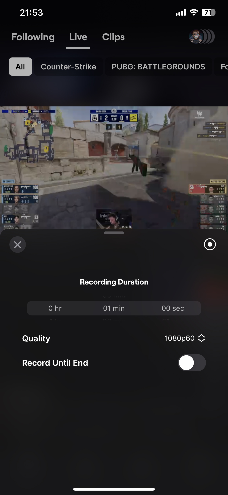
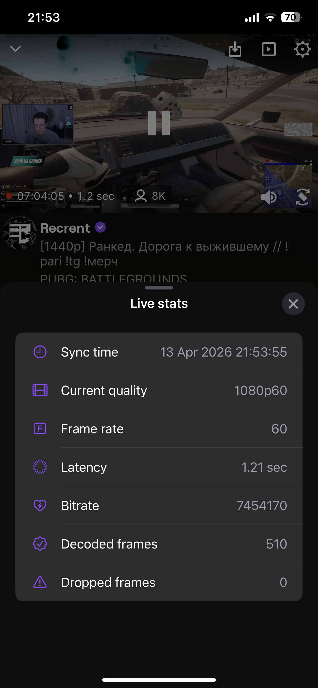
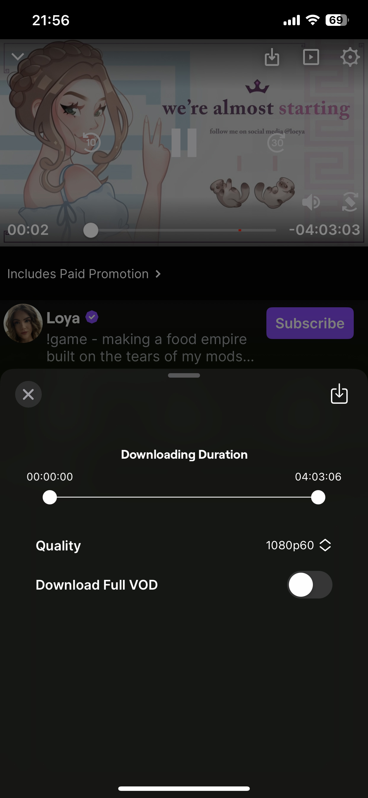
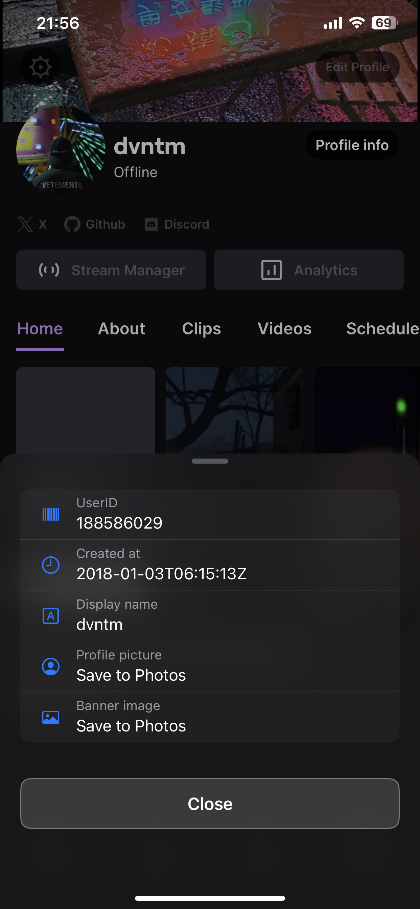
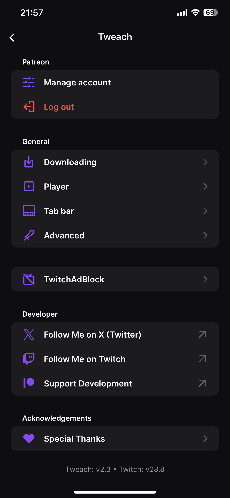

# Tweach
Download your favorite Clips, VODs and Live Streams with Tweach.

## Table of Contents
- [Screenshots](#screenshots)
- [Main Features](#main-features)
- [Supported Twitch Version](#supported-twitch-version)

## Screenshots
<table>
   <tr>
      <td></td>
      <td></td>
      <td></td>
   </tr>
</table>

  
More screenshots

  <table>
    <tr>
      <td></td>
      <td></td>
      <td></td>
    </tr>
  </table>

## Main Features
<li>Downloading: Download VODs, live streams and clips in selected quality, including audio only</li>
<li>Player customization: Hide unwanted controls, live stats overlay, gestures and system player support</li>
<li>Profile: Account info with high quality profile picture, banner and offline banner downloading</li>
<li>Tab bar customization: Reorder and hide tabs, set startup tab</li>
<li>Other: Import, export and reset preferences, clear cache manually or automatically on startup</li>
 

**Tweach preferences are available in the Twitch settings or by swiping up on the tab bar**
**Used open-source libraries are listed in the Acknowledgements section**

## Supported Twitch Version
<ul>
   <li><strong>Latest confirmed:</strong> <em>28.8</em></li>
   <li><strong>Date tested:</strong> <em>April 13, 2026</em></li>
   <li><strong>Tweach:</strong> <em>2.3</em></li>
</ul>
